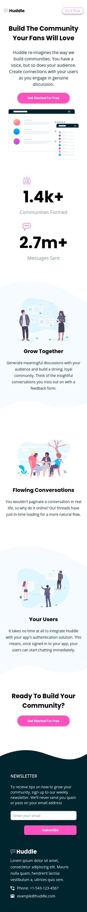
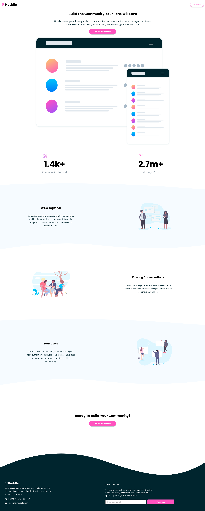

# Frontend Mentor - Huddle landing page with curved sections solution

This is a solution to the [Huddle landing page with curved sections challenge on Frontend Mentor](https://www.frontendmentor.io/challenges/huddle-landing-page-with-curved-sections-5ca5ecd01e82137ec91a50f2). Frontend Mentor challenges help you improve your coding skills by building realistic projects.

## Table of contents

- [Overview](#overview)
  - [The challenge](#the-challenge)
  - [Screenshot](#screenshot)
  - [Links](#links)
- [My process](#my-process)
  - [Built with](#built-with)
  - [What I learned](#what-i-learned)
  - [Continued development](#continued-development)
  - [Useful resources](#useful-resources)
- [Author](#author)
- [Acknowledgments](#acknowledgments)

## Overview

### The challenge

Users should be able to:

- View the optimal layout for the site depending on their device's screen size
- See hover states for all interactive elements on the page

### Screenshot

 

### Links

- Live Site URL: [live site URL](https://saurabhkacholiya.github.io/huddle-landing-page/)

## My process

- design first for mobile view using flex
- then design for desktop view

### Built with

- Semantic HTML5 markup
- CSS
- Flexbox
- Mobile-first workflow

### What I learned

- I am proud of the complete project
- Its in plain html and css
- The Design (CSS) is near to perfect of the given design in figma
- I am able to complete the project!!

```html
<header>using</header>
<main>semantic</main>
<footer>html</footer>
```

```css
.proud-of-this-css {
  /* 
          earlier i was using below code for displaying a curved image 
          but then realized minus (top : -39px) break in firefox so used the other section
        */
  /* position: absolute;
        top: -39px;
        left: 0;
        right: 0; */

  width: 100%;
  bottom: 0px;
  display: flex;
}
```

### Continued development

- How to write HTML fast.
- Understanding Design pattern
- Getting better at architecture planning of code

### Useful resources

- [Applied-accessibility](https://www.freecodecamp.org/learn/responsive-web-design/applied-accessibility/) - This helped me understand accessibility tag's and how to use them.
- [CSS Reset](https://piccalil.li/blog/a-modern-css-reset) - This helped me understand how to reset CSS how to remove predefined margin and padding by the browser.

## Author

- Website - [Saurabh Kacholiya](https://github.com/saurabhkacholiya)
- Frontend Mentor - [@saurabhkacholiya](https://www.frontendmentor.io/profile/saurabhkacholiya)
- Twitter - [@saurabhkacholiy](https://twitter.com/saurabhkacholiy)
